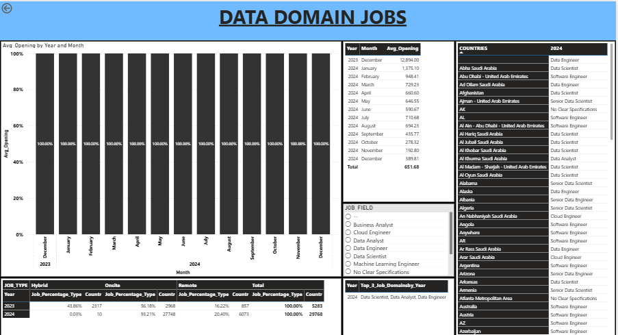
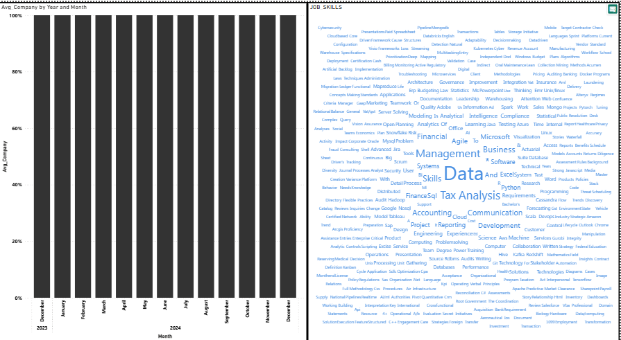

📊 Data Domain Jobs — Recruitment Analytics Dashboard

Project Overview
This project is a Recruitment and Job Market Analytics Dashboard developed using Power BI to analyze a large dataset of job postings in the data domain.
The project was created for a recruitment and selection firm that acquired job-opening data from multiple sources. The data was highly disorganized, with inconsistencies, missing information, fragmented tables, and both normalized and centralized data structures.
The dataset contains 700K+ rows, which also created challenges related to data processing, modeling, and Power BI report performance.
The goal of this project was to clean, structure, consolidate, and analyze the job-posting data and create an interactive dashboard that provides useful insights into hiring trends and the data-job market.

🎯 Project Objectives
The main objectives of this project were to:
Understand hiring trends over different years and months.
Analyze the distribution of job types over time.
Identify the most common job types by country and year.
Analyze the average number of companies hiring over time.
Identify the top 3 job fields for each year.
Identify the most in-demand job skills.
Create an interactive Power BI dashboard for recruitment analysis.
Build a structured dataset suitable for reporting and future analysis.
These objectives are based on the six requirements provided in the project document.

🗂️ Data Challenges
The original dataset had several challenges:
1. Data Inconsistency
The database contained inconsistent and missing information, making the data difficult to use directly for analysis. Some important information was also embedded inside lengthy and unstructured text.

2. Fragmented Tables
The data came from different sources and consisted of multiple fragmented tables without clear relationships between them.

3. Large Dataset
The dataset contained more than 700,000 rows, requiring careful data preparation and Power BI optimization to maintain report performance.

🛠️ Tools & Technologies
Tool / Technology	      Purpose
Power BI	              Data modeling, analysis, DAX, and dashboard development
Power Query	            Data cleaning and transformation
DAX	                    Calculations, KPIs, and analytical measures
Excel / Source Files	  Initial data sources
Data Modeling         	Connecting and consolidating multiple tables

🧹 Data Preparation
The data was prepared and structured according to the required business schema.
The consolidated dataset contains important fields such as:
Job_id
Job_title
Job_field
Company_name
Job_location
Job_posting_date
Job_level
Job_type
Job_skills
Job_employment_type
Summary
These fields were defined in the project requirements for creating a comprehensive job-posting table.

Data Preparation Process

Raw Data from Multiple Sources
              ↓
       Data Exploration
              ↓
      Data Cleaning
              ↓
   Handle Missing Values
              ↓
   Standardize Data Fields
              ↓
   Combine / Consolidate Data
              ↓
       Data Modeling
              ↓
      DAX Calculations
              ↓
      Power BI Dashboard 

📊 Dashboard Overview
The final dashboard is titled:

DATA DOMAIN JOBS
The dashboard provides an interactive overview of the job market using different visualizations, filters, tables, and analytical components.

📈 1. Job Openings by Year and Month
The dashboard contains a visualization for Average Opening by Year and Month.
This allows users to examine changes in job openings over time and identify monthly hiring patterns.
The analysis supports the requirement of understanding hiring trends and identifying periods of increased or decreased recruitment activity.

🏢 2. Average Companies Hiring
The dashboard includes an Average Company by Year and Month visualization.
This helps analyze recruitment activity over time by examining the average number of companies involved in hiring.
This supports the business requirement of understanding market activity and fluctuations in recruitment practices.

🌍 3. Country & Job Analysis
The dashboard provides country-level information along with job titles.
Users can explore job opportunities by different countries and identify the types of jobs available in different locations.
This supports the requirement of identifying the job types with the highest number of openings for different countries and years.

💼 4. Job Type Analysis
The dashboard analyzes different job types across years.
The project specifically focuses on understanding the distribution of job types such as:
Work From Home
Remote
Other job types available in the dataset
This helps identify how employment patterns are changing over time.

🏆 5. Top 3 Job Fields by Year
The dashboard contains a Top Job_3 Density by Year section.
This analysis identifies the most important or high-demand job fields for each year.
Understanding the top job fields helps recruitment teams focus on areas where demand is highest.

🧠 6. Most In-Demand Job Skills
A Job Skills visualization was created to display the skills appearing across job postings.
The word-cloud visualization provides a quick view of frequently required skills in the data-domain job market.
This helps identify important technical and professional skills that employers are looking for and can support recruitment and training decisions.

🔎 Dashboard Filters
The dashboard provides interactive filtering capabilities, including:
Year
Month
Country
Job Field
Job Title
These filters allow users to explore the job market from different perspectives.
For example:

Select Country
      ↓
Select Year
      ↓
Select Job Field
      ↓
Analyze Job Openings
      ↓
Identify Hiring Trends

📋 Key Business Questions Answered
This dashboard helps answer questions such as:

Hiring Trends
How do job openings change over time?
Which months show higher hiring activity?
How does hiring activity differ between years?

Job Types
What types of jobs are most common?
How is the distribution of job types changing over time?

Geography
Which countries have the highest job demand?
What job types are popular in different countries?

Job Fields
What are the top 3 job fields for each year?
Which fields are experiencing higher demand?

Skills
What skills are most frequently required?
What skills should candidates focus on developing?

📷 Dashboard Preview

🧮 Power BI & DAX

Power BI was used for:
Data modeling
Data transformation
Interactive filtering
Job-opening analysis
Company analysis
Job-field analysis
Country analysis
Skill analysis

DAX calculations were used to create analytical measures such as:
Average job openings
Average companies
Job counts
Top job fields
Year and month analysis
Country-level analysis

⚡ Performance Optimization

Because the dataset contains 700K+ rows, performance was an important part of the project.
The project requirements specifically emphasized optimizing the Power BI report so that the large volume of data could be handled without compromising report speed and accuracy.

The project therefore focuses on:
Efficient data modeling
Removing unnecessary data
Data transformation before visualization
Appropriate aggregation
Efficient DAX calculations
Using filters effectively
Reducing unnecessary visual complexity

📊 Business Value
This dashboard can help a recruitment organization:
Understand hiring trends.
Identify high-demand job fields.
Monitor recruitment activity.
Compare hiring patterns across countries.
Identify popular job types.
Understand the skills employers require.
Support workforce planning.
Improve recruitment strategies.
Identify emerging opportunities in the data-job market.

🎓 Project Highlights

Large Dataset
700K+ job-posting records

Main Domain
Data / Technology Job Market

Dashboard Tool
Microsoft Power BI

Main Analysis Areas

Hiring Trends
     ↓
Job Types
     ↓
Countries
     ↓
Companies
     ↓
Job Fields
     ↓
Job Skills

👨‍💻 Author
Aayush Chaudhary
B.Tech — Computer Science & Engineering

Skills
Power BI Python SQL Excel DAX Data Analytics Power Query Data Visualization

⭐ Conclusion
The Data Domain Jobs Dashboard transforms a large and disorganized job-posting dataset into an interactive Business Intelligence solution.
The project demonstrates the complete process of working with large-scale recruitment data — from data cleaning and consolidation to data modeling, DAX analysis, visualization, and performance optimization.
The final dashboard provides useful insights into hiring trends, job types, countries, companies, job fields, and in-demand skills, helping recruitment teams make more informed and data-driven decisions.
